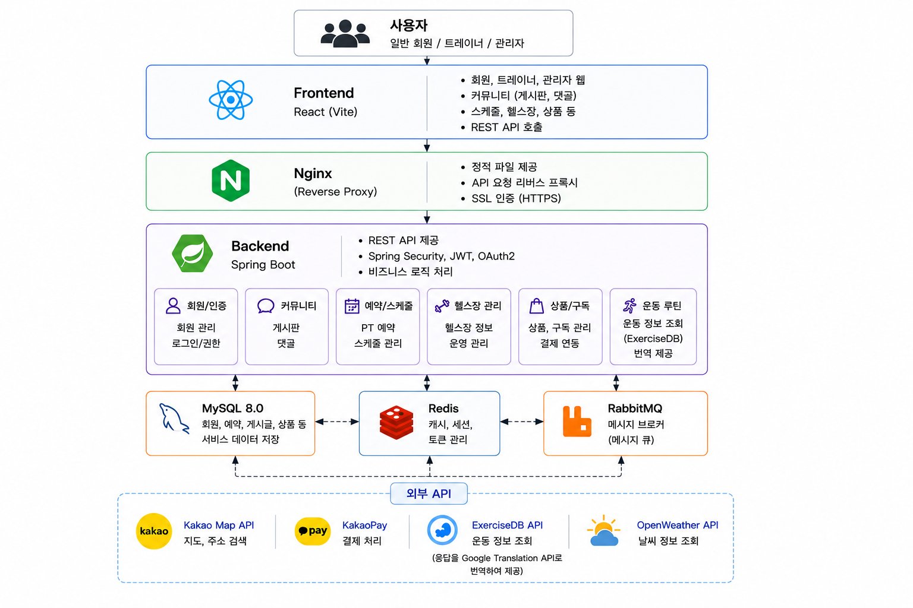
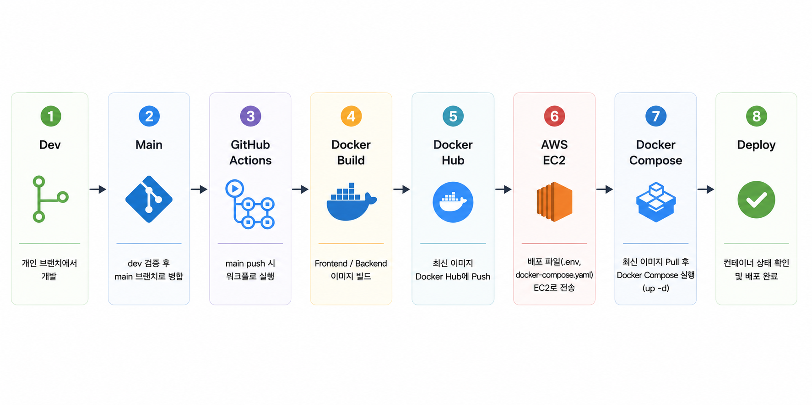
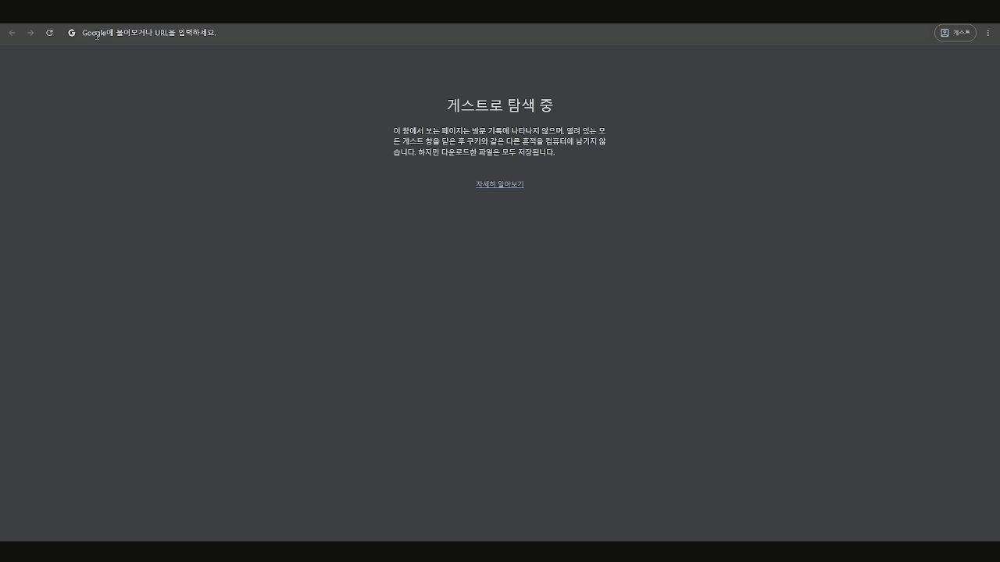
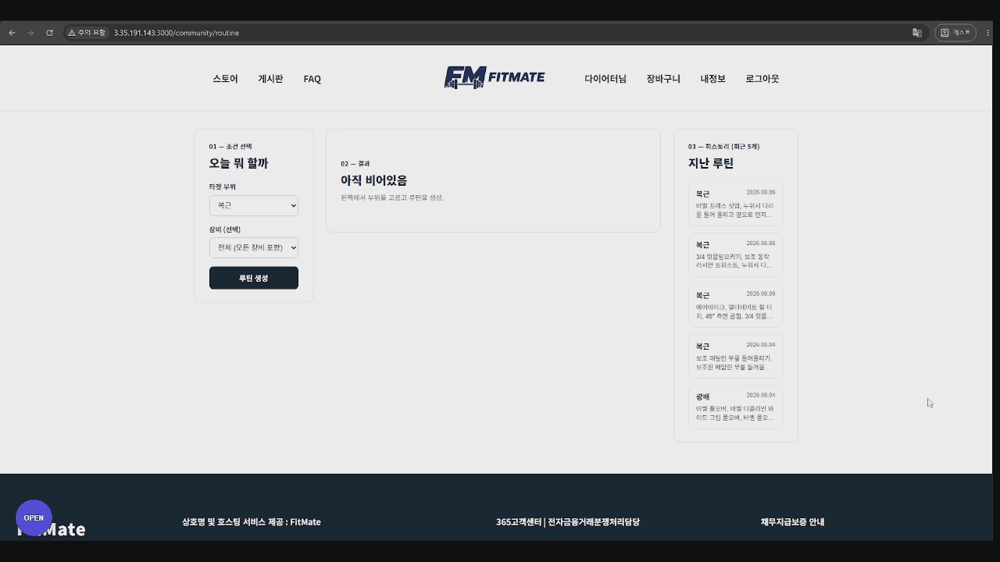
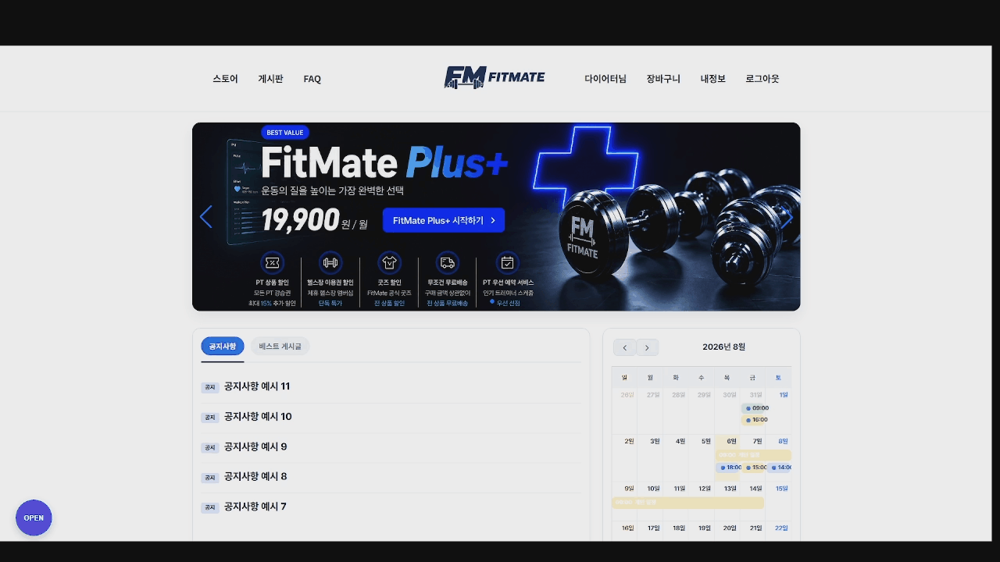
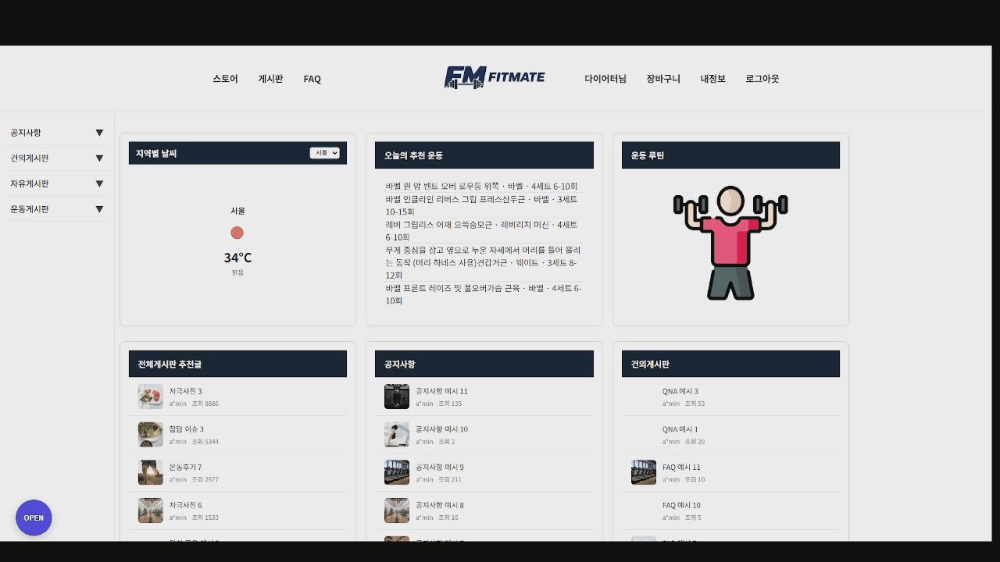
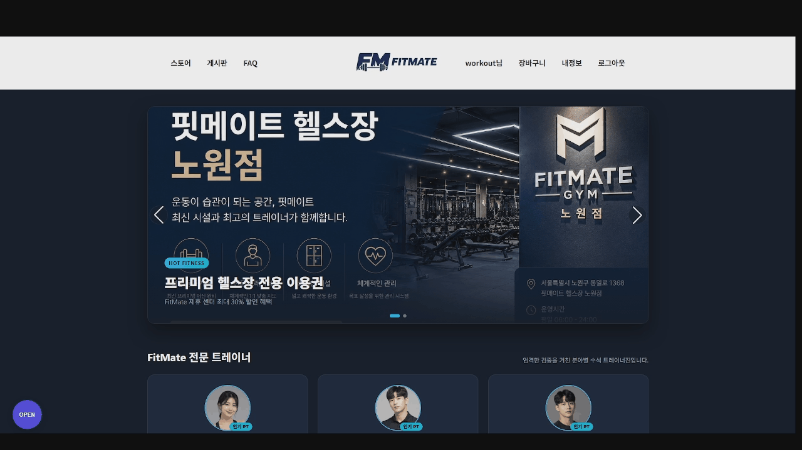
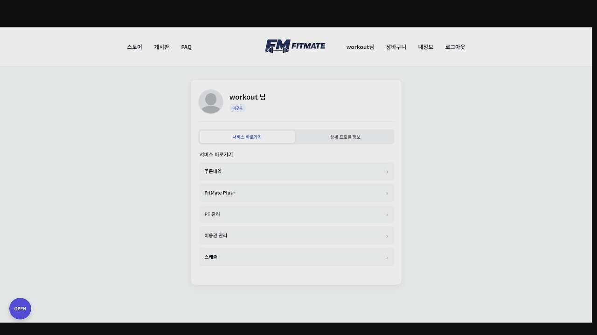
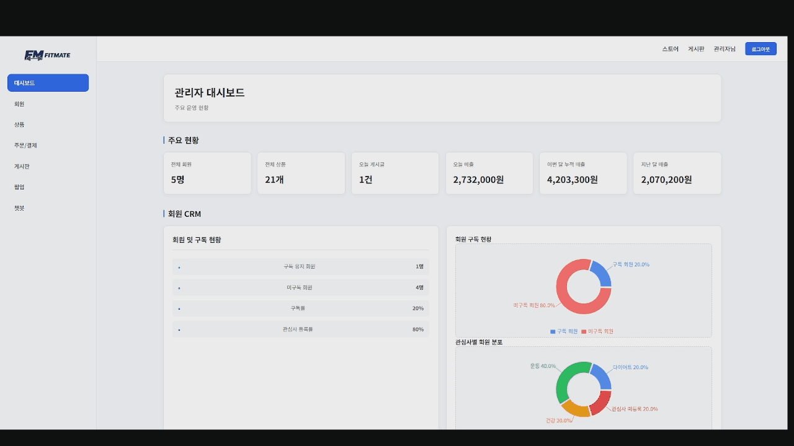

  

<h1 align="center">FitMate</h1>

운동 관리와 헬스장 CRM을 하나로 통합한 Full Stack 웹 서비스

---

> 스케줄 관리, 커뮤니티, 구독 서비스와 헬스장 CRM을 하나의 플랫폼으로 통합한 Full Stack 웹 서비스

FitMate는 운동을 지속하기 어려운 사용자와 회원 관리에 어려움을 겪는 헬스장을 위해 개발한
운동 루틴, 일정 관리와 헬스장 CRM을 하나의 서비스에서 제공하는 통합 플랫폼입니다.

사용자는 운동 루틴 생성, 일정 관리, PT 예약, 이용권 구매, 커뮤니티 기능을 이용할 수 있으며,
관리자는 회원, 상품, 예약, 결제, 커뮤니티, 팝업을 관리하고 Dashboard를 통해 핵심 운영 지표를 확인할 수 있습니다.

프로젝트에서는 팀장으로서 프로젝트 구조 설계와 Git 협업 환경을 구축하고,
관리자 Dashboard, FullCalendar 및 Kakao Map 공통 컴포넌트 개발과 Docker 기반 CI/CD 구축을 담당했습니다.

## 📋 프로젝트 정보

| 구분 | 내용 |
|------|------|
| 프로젝트명 | FitMate |
| 개발 기간 | **2026.06.26 ~ 2026.07.31** |
| 개발 인원 | 4명 |
| 프로젝트 형태 | Spring Boot + React 기반 팀 프로젝트 |
| 담당 역할 | 팀장 · 관리자 대시보드 · Calendar / Kakao Map 공통 컴포넌트 · CI/CD 구축 |
| 배포 환경 | Docker · Docker Hub · GitHub Actions · AWS EC2 |

## 🛠 기술 스택
### Front-End

  
  
  
  

### Back-End

  
  
  
  
  
  

### Database & Messaging

  
  
  

### DevOps

  
  
  
  
  

### API

  
  
  
  

### Collaboration

  
  
  

---
## 🏗 시스템 구성

React와 Spring Boot를 기반으로 서비스를 구성하였으며,
Nginx를 통해 정적 파일 제공과 백엔드 API 요청을 처리합니다.

  

---

## 🚀 CI/CD 파이프라인

Dev 브랜치에서 기능을 통합·검증한 뒤 Main 브랜치에 병합하면,
GitHub Actions가 Frontend와 Backend Docker 이미지를 빌드하여 Docker Hub에 업로드합니다.

이후 EC2에서 최신 이미지를 받아 Docker Compose로 서비스를 자동 재배포하도록 구성하였습니다.

  

---

## 📷 프로젝트 미리보기

### 🏠 메인 페이지

서비스의 주요 기능과 상품, 커뮤니티 게시글, 공지사항 및 팝업 정보를 한 화면에서 확인할 수 있습니다.

  

---

### 🏋️ 운동 루틴

운동 부위와 종목을 선택하여 개인 운동 루틴을 생성하고, 저장된 루틴을 조회할 수 있습니다.

  

---

### 📅 스케줄 관리

FullCalendar를 활용하여 개인 일정, 운동 일정, PT 예약 내역을 통합 조회하고 관리할 수 있습니다.

  

---

### 👥 커뮤니티

운동 관련 게시글을 작성하고 댓글을 통해 사용자 간 정보를 공유할 수 있습니다.

  

---

### 💳 이용권 구매

헬스장 이용권과 PT 상품을 조회하고 카카오페이를 통해 결제할 수 있습니다.

  

---

### 📆 PT 예약

보유한 PT 이용권을 기반으로 트레이너와 예약 가능한 일정을 확인하고 PT를 예약할 수 있습니다.

  

---

### 🛠 관리자 페이지

#### Dashboard

회원, 상품, 예약, 결제 및 커뮤니티 데이터를 기반으로 핵심 운영 지표를 확인할 수 있습니다.

  

---

## ✨ 주요 기능

### 👤 사용자

- 사용자 관심사 기반 추천 상품 및 커뮤니티 게시글 제공
- 운동 루틴 생성 및 조회
- FullCalendar 기반 일정 관리
- PT 예약
- 커뮤니티 게시글 및 댓글
- 이용권 구매 및 카카오페이 결제 지원
- OAuth2 로그인
- 마이페이지

### 👨‍💼 관리자

- 관리자 대시보드
- 회원 관리
- 상품 관리
- 예약 관리
- 결제 관리
- 커뮤니티 관리
- 팝업 관리
- 챗봇 질문/답변 관리

---

## 👨‍💻 담당 역할

### 프로젝트 관리

- 팀장 역할 수행
- 프로젝트 구조 설계
- Git 협업 전략 수립
- GitHub 브랜치 전략 관리

### Front-End

- 사용자 관심사 기반 메인 페이지 추천 기능 개발
- FullCalendar 기반 공통 Calendar 컴포넌트 개발
- 주소 검색 및 지도 표시를 위한 Kakao Map 공통 컴포넌트 개발
- 관리자 Dashboard UI 및 기능 구현

### Back-End

- 관리자 Dashboard API 개발
- 메인 페이지 API 개발
- 운동 일정, PT 예약, 개인 일정을 통합 조회하는 Calendar API 개발

### DevOps

- Docker 기반 개발 및 배포 환경 구성
- Docker Hub 기반 이미지 관리
- GitHub Actions 기반 CI/CD 구축
- AWS EC2 배포 환경 구축

---

